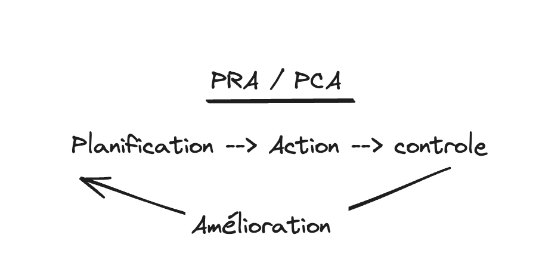

La sécurité et la sûreté sont deux concepts qui sont souvent confondus. Dans cet article, nous allons voir la différence entre ces deux termes.

<!--more-->

## Les notion
### Sécurité

La sécurité est un concept qui se rapporte à la protection des biens et des personnes contre les menaces. Elle vise à prévenir les risques et à protéger les biens et les personnes contre les dangers. La sécurité peut être assurée par des mesures de prévention, de protection et de réaction.

La sécurité peut être de plusieurs types, tels que la sécurité informatique, la sécurité des personnes, la sécurité des biens, la sécurité des données, etc.

Dans le cadres de l'informatique, la sécurité informatique vise à protéger les systèmes informatiques.
dans la securité il y a les données, les personnes, les biens, les systèmes, les réseaux, les applications, etc.
en 2018 il parut la fameuse lois RDPG qui est une loi sur la protection des données personnelles.

- **La CNIL doit etre informée 72 heures apres la decouverte de tout leaks de données personnelles.**

### Sûreté

La sûreté est un concept qui se rapporte à la protection des biens et des personnes contre les actes de malveillance. Elle vise à prévenir les actes de malveillance et à protéger les biens et les personnes contre les attaques.

On va voir le principe de PCA et PRA.

## PCA et PRA

Prenon l'exemple de vacances au ski.
- **Planification** : On planifie les vacances, on choisit la station, on réserve l'hébergement, on prépare les affaires, etc.
- **Action** : On part en vacances, on skie, on se repose, on profite, etc.
- **Controle** : On vérifie que tout se passe bien, que tout est en ordre, que tout est conforme, etc.
- **Amélioration** : On améliore l'organisation, on corrige les erreurs, on ajuste les processus, etc.

Le PCA et le PRA sont des document ecrit il y a 3 grand point.
- **Procédure** : Comment faire pour rétablir les activités après un sinistre.
- **Matériel** : Quels sont les équipements nécessaires pour rétablir les activités après un sinistre.
- **RH** : Quels sont les ressources humaines nécessaires pour rétablir les activités après un sinistre.
 

### PRA

Le Plan de Reprise d'Activité (PRA) est un plan qui permet de rétablir les activités de l'entreprise après un sinistre. Il vise à minimiser les pertes et à rétablir les activités le plus rapidement possible.

- P = Plan
- R = Reprise
- A = Activité

Le R correspond à la reprise des activités après un sinistre. Il s'agit de rétablir les activités de l'entreprise le plus rapidement possible pour minimiser les pertes. donc ca veux dire et a l'arrêt.

**Le PRA c'est qu'il n'y a plus rien qui marche et il faut tout remettre en place.**

### PCA

Le Plan de Continuité d'Activité (PCA) est un plan qui permet de maintenir les activités de l'entreprise en cas de sinistre. Il vise à assurer la continuité des activités et à minimiser les pertes.

- P = Plan
- C = Continuité
- A = Activité

Le C correspond à la continuité des activités en cas de sinistre. Il s'agit de maintenir les activités de l'entreprise malgré le sinistre pour minimiser les pertes. donc ca veux dire et en marche mais avec des pertes.

**Le PCA  c'est qu'il y a un sinistre mais il faut continuer a travailler.**

## Conclusion

En bref, le PCA (Plan de Continuité d'Activité) et le PRA (Plan de Reprise d'Activité) sont super importants pour que les entreprises restent solides face aux crises. Le PCA assure que les activités essentielles continuent même en cas de gros pépin, tandis que le PRA explique comment remettre tout en marche après une interruption. J'ai trouvé ça vraiment intéressant parce que ça montre comment les entreprises peuvent se préparer et continuer à fonctionner en situation de crise, ce qui renforce leur durabilité et leur robustesse.
